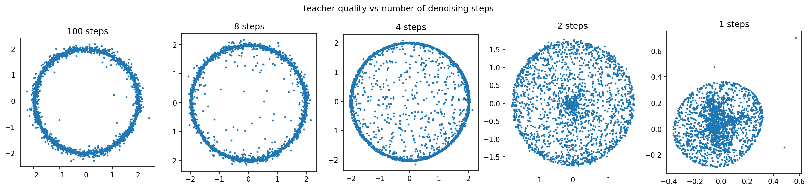
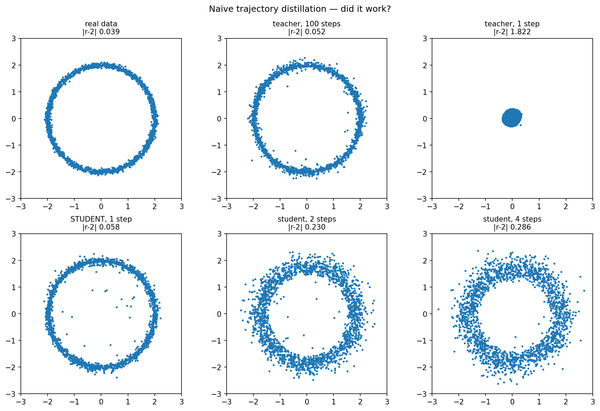
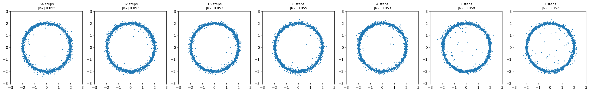
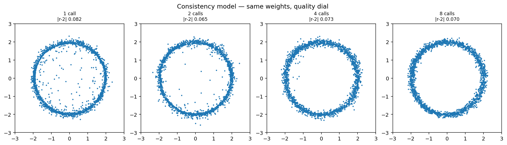

# flow-distillation


A toy flow-matching model (2D ring) built to learn generative-model
distillation from the ground up — preparation for a research internship on
distilling world models. Everything here is deliberately small (~100 lines
per method, CPU-only, seconds to minutes to train) so every line stays
understandable. The point is understanding, not scale.

This is a learning/portfolio repo reproducing three known distillation
methods at toy scale — not novel research. Said plainly, up front.

## The problem, in one image



A flow-matching model generates by taking many small denoising steps —
clean ring at 100 steps. Force the *same* model to answer in 1 step, with
no retraining, and it collapses into a blob. That blob is the whole
problem statement of this repo.

## Why this matters

Sampling cost is `steps × (one network call)`. A real-time system — the
motivating case here is a world model, not a picture of a ring — can't
afford 100 sequential network calls per frame; it needs 1-2. But naively
asking a model trained for 100 steps to run in 1 doesn't work, as the
image above shows. **Distillation is training a *student* network to
survive that shortcut** — to do in one step (or a few) what the teacher
needed a hundred for.

## Three distillation strategies

All three turn the 100-step teacher into a fast student, via different
mechanisms — each detailed further in its own module docstring.

### Naive trajectory distillation ([`naive.py`](src/naive.py) — Luhman & Luhman 2021 style)

Roll the teacher all the way out (100 steps) from a random noise start,
and regress the student directly onto that single start → end arrow. One
giant leap, one training phase, no real data ever touched — the student's
only signal is the teacher's own rollout.

**Trade-off:** expensive per training step (100 teacher calls to build one
training example) and a hard regression target, since the student must
correct for the whole trajectory's curvature at once. It also has **no
step-count dial** — it was only ever trained to be asked once, at `t=0`;
pushing it to run for 2 or 4 steps anyway makes it *worse*, not better
(see the result image below).



### Progressive distillation ([`progressive.py`](src/progressive.py) — Salimans & Ho 2022)

Halve the step count repeatedly instead of leaping straight to 1: a new
student is warm-started from the previous round's weights and trained to
compress 2 of its teacher's steps into 1 of its own — `64 → 32 → 16 → 8 →
4 → 2 → 1`, seven rounds total.

**Trade-off:** far cheaper per training step (2 teacher calls, not 100)
and each round is a much gentler extrapolation — but it costs 7 separate
training rounds instead of 1, and produces a *fixed*-step-count model each
round, not a runtime dial.



### Consistency distillation ([`consistency.py`](src/consistency.py) — Song et al. 2023)

A completely different mechanism: train a function `f(x, t)` so that
*every* point along a noise → data path predicts the *same* final
destination, anchored by a boundary condition (`f(x, t=1) = x`, locking
the data end) and an EMA target network (a slow-moving copy, so both
sides of the loss can't drift into agreeing on garbage together).

**Trade-off:** cheapest per training step (1 teacher call) — but the
*only* strategy of the three with a genuine runtime dial: the exact same
trained weights can be asked for a fast, rough 1-call answer, or a
slower, more refined multi-call answer, with zero retraining.



## The comparison

Mean `|radius - 2|` over 2000 samples (lower is better; real data itself
scores **0.038** — that's the noise floor, not zero, since `sample_ring`
has intrinsic Gaussian fuzz).

| Method | Target | Teacher calls / training step | Total teacher calls | Training rounds | 1-step `\|r-2\|` | Best quality (at how many calls) | Step-count dial? | Needs real dataset? |
|---|---|---|---|---|---|---|---|---|
| **Naive** ([Luhman & Luhman 2021](#references)) | Full rollout endpoint, one leap | 100 | 500,000 | 1 | 0.058 | 0.058 (1 call — gets *worse* with more) | No | **No** — teacher + noise only |
| **Progressive** ([Salimans & Ho 2022](#references)) | 2 teacher steps → 1 | 2 | 28,000 | 7 | 0.057 | 0.053 (holds steady, 64→1) | No — one checkpoint per step count | Yes |
| **Consistency** ([Song et al. 2023](#references)) | Self-consistency along the path | 1 | 30,000 | 1 | 0.082 | 0.065 (2 calls) | **Yes** — one checkpoint, any call count | Yes |

Naive distillation needs no dataset at all — its only training signal is
the teacher's own rollout from noise, which is a genuinely interesting
property, not an oversight: check `distill_one_step`'s signature in
`naive.py`, there's no `sample_data` parameter.

## Honest findings

- **The loss is a liar; the picture is the judge.** The teacher's training
  loss flattens at roughly **1.85** and stays there — that flat, nonzero
  floor looks like a bug (or a collapsed model) the first time you see
  it, but it isn't. Flow matching's per-example target is a *conditional*
  arrow that ignores every other data point; averaged over enough steps
  it becomes the correct marginal field (the theory behind this is
  covered in the [MIT flow matching lecture notes](#references)), but the
  loss itself never converges to zero even for a perfect model. Only
  actually generating and plotting samples tells you whether training
  worked — every plot in this README exists because of that rule.

- **Two real bugs, on the way to the consistency-model result above.**
  (1) `generate_consistency`'s refinement loop re-noised a point, then
  told the model that same point's time was `tau` instead of the correct
  `1 - tau` — mislabeling how noisy the point actually was, which meant
  refinement rounds barely corrected anything. (2) With `dt=0.01`,
  self-consistency has to propagate backward through roughly 100
  sequential hops from the one place it's anchored for free (`t≈1`) to
  `t=0`, the point every single-call generation actually depends on;
  `8000` training steps wasn't enough for that relay to complete, so even
  bug-free single-call generation collapsed toward the origin. Both loss
  numbers looked fine throughout — near-zero and smoothly converging —
  while the generated samples were a tight blob, not a ring. The working
  configuration: `dt=0.05` (shortens the relay to ~20 hops) and
  `steps=30000` (more iterations for that shorter relay to finish);
  `ema_decay=0.999` was never the problem.

## Layout

```
flow-distillation/
├── src/                        the library — algorithms, importable, never run directly
│   ├── data.py                 p_data: the ring (+ moons, unused by default) + radius_err metric
│   ├── model.py                VelocityNet — the vector field u_theta(x, t)
│   ├── training.py             flow matching training (how the teacher is made)
│   ├── sampling.py             Euler sampling loop (steps = denoising steps)
│   ├── naive.py                naive distillation: match the teacher's full trajectory in one leap
│   ├── progressive.py          progressive distillation: repeatedly halve steps, 64 -> 1
│   └── consistency.py          consistency distillation: self-consistency + a runtime quality dial
├── scripts/                    the runners — one script per action, saves checkpoints/plots
│   ├── train_teacher.py        trains teacher -> checkpoints/teacher.pth
│   ├── eval_teacher.py         plots teacher_100steps.png + teacher_step_sweep.png
│   ├── naive_distill.py        runs naive.py -> checkpoints/student.pth
│   ├── eval_naive.py           plots naive_distill_result.png
│   ├── progressive_distill.py  runs progressive.py -> checkpoints/progressive_1step.pth + progressive.png
│   └── consistency_distill.py  runs consistency.py -> checkpoints/consistency.pth + consistency.png
├── checkpoints/                saved model weights (.pth) — gitignored, regenerated by the scripts above
└── plots/                      saved figures — gitignored except the four referenced in this README
```

## How to run

From the project root, in dependency order:

```bash
python -m scripts.train_teacher        # trains + saves the teacher (~30s on CPU)
python -m scripts.eval_teacher         # plots: clean ring + the step-degradation sweep
python -m scripts.naive_distill        # naive distillation -> checkpoints/student.pth
python -m scripts.eval_naive           # plots the naive result (incl. teacher forced to 1 step)
python -m scripts.progressive_distill  # halving distillation -> checkpoints/progressive_1step.pth
python -m scripts.consistency_distill  # self-consistency distillation -> checkpoints/consistency.pth
```

## References

- Hinton, Vinyals & Dean, 2015. *Distilling the Knowledge in a Neural
  Network.* [arXiv:1503.02531](https://arxiv.org/abs/1503.02531)
- Salimans & Ho, 2022. *Progressive Distillation for Fast Sampling of
  Diffusion Models.* [arXiv:2202.00512](https://arxiv.org/abs/2202.00512)
- Song, Dhariwal, Chen & Sutskever, 2023. *Consistency Models.* ICML 2023.
- Luhman & Luhman, 2021. *Knowledge Distillation in Iterative Generative
  Models for Improved Sampling Speed.*
- Holderrieth & Peng. *Flow Matching* — MIT lecture notes (the source of
  the `Algorithm 1`/`Algorithm 3`/`Theorem 12` references throughout the
  code's docstrings).
